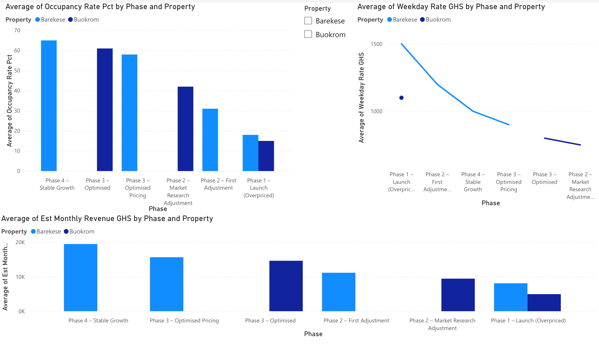
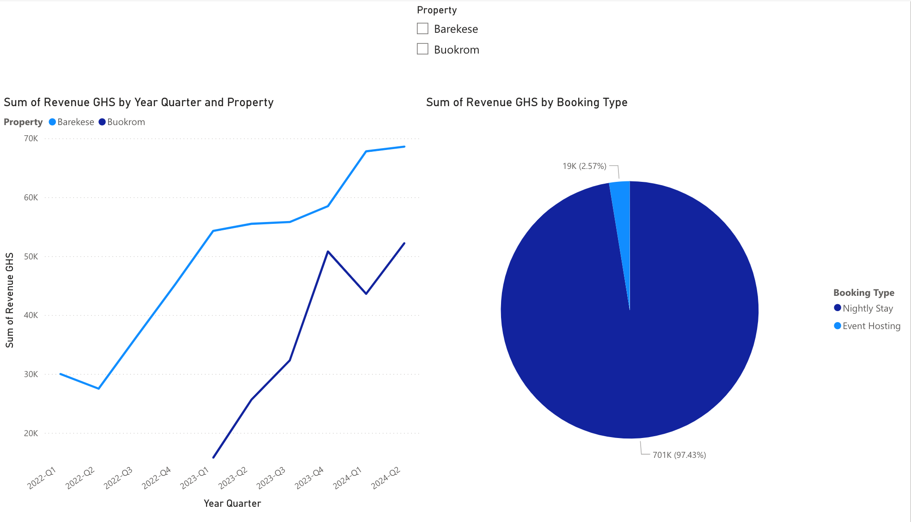
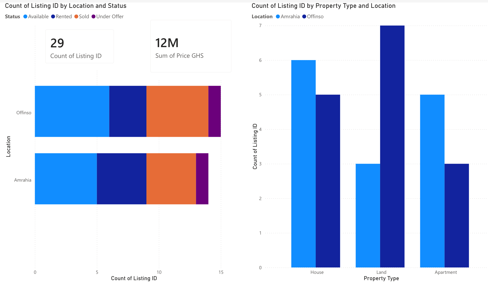
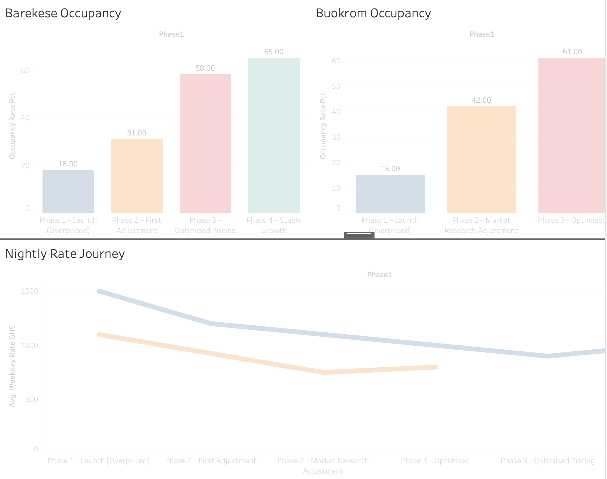
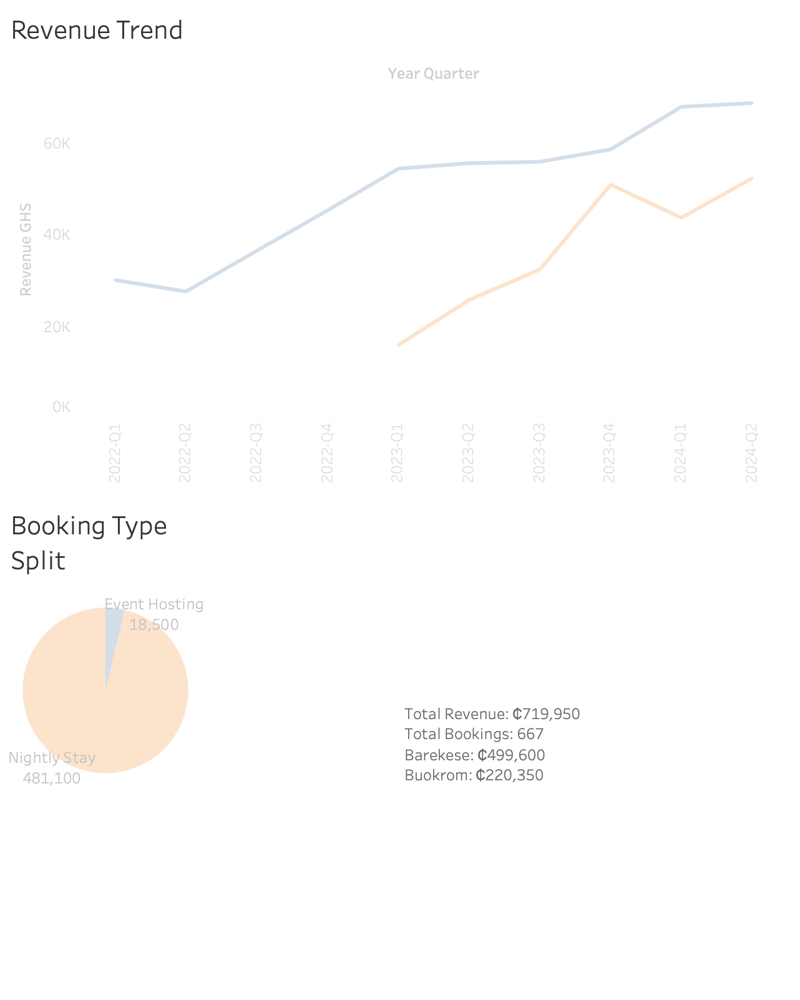
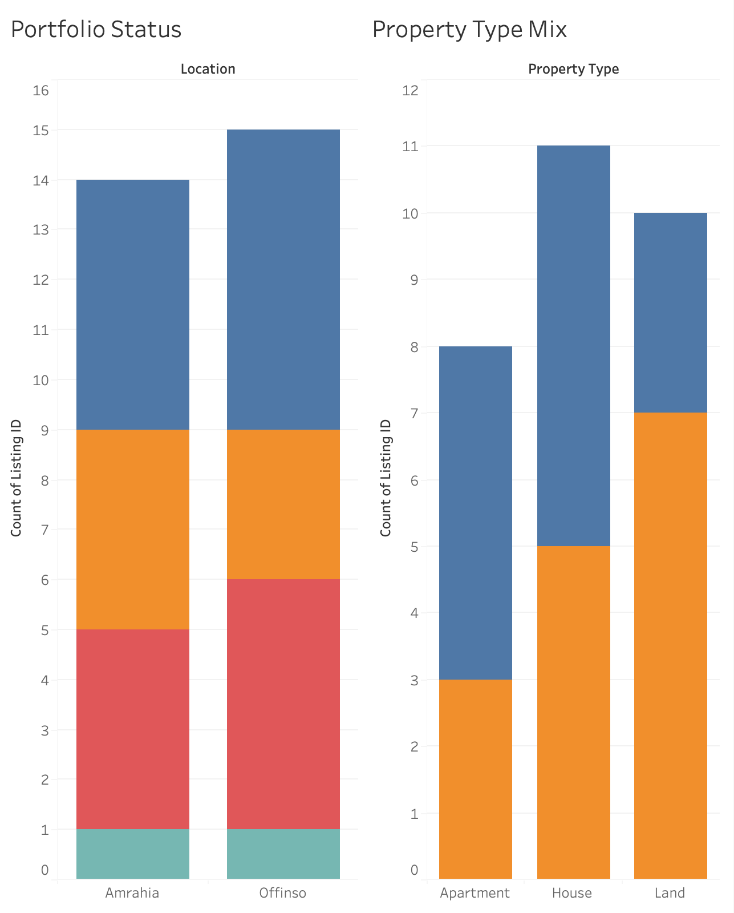

# 🏠 Chrispo E.P.O LTD — Real Estate & Short-Stay Analytics

> **Data-driven pricing optimisation and property portfolio analysis across four locations in Ghana — turning raw booking and listing data into actionable management insights.**

[](https://python.org)
[](https://pandas.pydata.org)
[](https://app.powerbi.com/reportEmbed?reportId=e14e77e1-f15d-4fce-b43a-9b625758b448&autoAuth=true&ctid=00449dde-2c61-47fa-81ef-e0761befef8d)
[](https://public.tableau.com/app/profile/frederick.opoku.afriyie6847/viz/ChrispoEPOLTDRealEstateAnalytics)
[](https://chrispo-real-estate-analytics.onrender.com/)
[](LICENSE)

---

## 📌 Background

This project was built from my real consulting work with **Chrispo E.P.O LTD**, a Ghanaian property company operating across two regions. My role spanned full-stack development, data analysis, and pricing strategy.

The core challenge: **two short-stay properties launched at prices too high for the market**, resulting in very low occupancy. I analysed booking patterns, benchmarked against the local market, and recommended a data-driven repricing strategy — which delivered a **+290% revenue uplift** on the Barekese property after implementation.

---

## 📍 Properties Covered

| Property | Location | Region | Business Model |
|----------|----------|--------|----------------|
| **Barekese Apartment** | Barekese, Kumasi | Ashanti Region | Short Stay & Event Hosting |
| **Buokrom AirBnB** | Buokrom, Kumasi | Ashanti Region | AirBnB / Short Let |
| **Offinso Portfolio** | Offinso | Ashanti Region | Property Sales, Rentals & Land |
| **Amrahia Portfolio** | Amrahia, Accra | Greater Accra Region | Property Sales & Rentals |

---

## 🔑 Key Insights

### Short-Stay Pricing Journey
| Metric | Barekese | Buokrom |
|--------|----------|---------|
| Phase 1 Occupancy (overpriced) | 18% | 15% |
| Phase 3 Occupancy (optimised) | 58% | 61% |
| Starting weekday rate | GHS 1,500/night | GHS 1,100/night |
| Optimised weekday rate | GHS 900/night | GHS 800/night |
| **Revenue uplift from repricing** | **+290%** | **+196%** |

### Real Estate Portfolio (Offinso & Amrahia)
| Metric | Offinso | Amrahia |
|--------|---------|---------|
| Total Listings | 15 | 14 |
| Portfolio Value | GHS 3.1M | GHS 8.4M |
| Units Sold | 5 | 4 |
| Units Rented | 3 | 4 |

---

## 🗂️ Repository Structure

```
chrispo-real-estate-analytics/
│
├── data/
│   ├── chrispo_bookings_data.csv          # Booking records: Barekese & Buokrom
│   ├── chrispo_listings_data.csv          # Property listings: Offinso & Amrahia
│   ├── chrispo_pricing_journey.csv        # Pricing phase analysis
│   └── Chrispo_EPO_Analytics_Workbook.xlsx  # Full Excel workbook (4 sheets)
│
├── eda/
│   ├── chrispo_real_eda.py                # Full EDA script
│   ├── fig1_pricing_journey.png           # Pricing phases: rates, occupancy, revenue
│   ├── fig2_booking_performance.png       # Booking trends & phase comparison
│   └── fig3_listings_analysis.png        # Offinso & Amrahia portfolio analysis
│
├── dashboards/
│   ├── Chrispo_PowerBI_Dashboard.pbix     # Power BI: Operational view
│   └── Chrispo_Tableau_Dashboard.twbx    # Tableau: Executive / investor view
│
├── screenshots/
│   ├── powerbi_pricing_journey.png
│   ├── powerbi_booking_performance.png
│   ├── powerbi_portfolio.png
│   ├── tableau_pricing_journey.png
│   ├── tableau_booking_performance.png
│   └── tableau_portfolio.png
│
└── README.md
```

---

## 📊 Analysis Breakdown

### Figure 1 — Pricing Journey
Shows the complete repricing story across all phases for both Barekese and Buokrom:
- Occupancy rate per phase (Phase 1 was drastically underperforming)
- Nightly rate changes (weekday vs weekend) with annotated decision points
- Estimated monthly revenue impact of each pricing decision

### Figure 2 — Booking Performance
- Monthly revenue trends for both properties over time
- Weekday vs weekend revenue split
- Event vs nightly stay revenue breakdown (Barekese)
- Side-by-side phase revenue comparison

### Figure 3 — Real Estate Portfolio
- Listing status breakdown by location (Sold / Available / Rented / Under Offer)
- Property type mix (Apartment / House / Land)
- Sale price distribution by location
- Monthly rental rates by unit

---

## 🚀 Live App

> **[chrispo-real-estate-analytics.onrender.com](https://chrispo-real-estate-analytics.onrender.com/)**
> Interactive Plotly Dash app — Pricing Journey · Booking Performance · Property Portfolio

---

## 📊 Dashboard Features

### Power BI — Operational Dashboard
🔗 **[View Live Dashboard](https://app.powerbi.com/reportEmbed?reportId=e14e77e1-f15d-4fce-b43a-9b625758b448&autoAuth=true&ctid=00449dde-2c61-47fa-81ef-e0761befef8d)**

- **KPI cards**: Occupancy rate, total revenue, avg nightly rate (per phase)
- **Phase comparison bar chart**: Revenue before and after repricing
- **Booking calendar heatmap**: Demand patterns by day of week and month
- **Property listings table**: Offinso & Amrahia with status filters
- **Slicers**: Property, year, booking type, status

| Pricing Journey | Booking Performance | Portfolio Overview |
|:-:|:-:|:-:|
|  |  |  |

### Tableau — Executive / Investor Dashboard
🔗 **[View Live Dashboard](https://public.tableau.com/app/profile/frederick.opoku.afriyie6847/viz/ChrispoEPOLTDRealEstateAnalytics)**

- **Occupancy trend line**: Phase-by-phase visualisation of pricing impact
- **Revenue vs Rate scatter**: Showing the inverse relationship between price and volume
- **Portfolio map**: Ghana locations with value indicators
- **Price-to-occupancy funnel**: Decision framework used in the repricing work

| Pricing Journey | Booking Performance | Portfolio Overview |
|:-:|:-:|:-:|
|  |  |  |

---

## ⚙️ How to Run the EDA

```bash
# 1. Clone the repo
git clone https://github.com/fredopoku/chrispo-real-estate-analytics.git
cd chrispo-real-estate-analytics

# 2. Install dependencies
pip install pandas numpy matplotlib seaborn openpyxl

# 3. Run the EDA
python eda/chrispo_real_eda.py
```

Output: three figures saved to the `eda/` folder + key insights printed to console.

---

## 🛠️ Tech Stack

| Tool | Purpose |
|------|---------|
| Python 3.10+ | Data processing & EDA |
| Pandas | Data wrangling and aggregation |
| Matplotlib / Seaborn | Charts & visualisations |
| Power BI Desktop | Operational management dashboard |
| Tableau Public | Executive investor dashboard |
| Excel / openpyxl | Structured data workbook (4 sheets) |

---

## 💡 What This Project Demonstrates

- **Real business problem-solving** — not a toy dataset, this is actual pricing work done for a real client
- **Data-driven decision making** — using occupancy and revenue data to recommend and validate a repricing strategy
- **End-to-end pipeline** — from raw data structuring → EDA → Excel reporting → interactive dashboards
- **Dual-tool dashboarding** — Power BI for operations, Tableau for executive/investor storytelling
- **Ghana market context** — GHS/USD dual-currency analysis across Ashanti and Greater Accra regions

---

## 🔗 Related Work

This project is part of my broader engagement with Chrispo E.P.O LTD, which also included building their property listings web platform (front-end + price analysis feature). View the full portfolio:

👉 **[frederick-opoku-afriyie.netlify.app](https://frederick-opoku-afriyie.netlify.app/)**

---

## 👤 Author

**Frederick Opoku Afriyie**
MSc Computer Science (Merit) · Software Engineer & AI Researcher · Vision'97 Co-Founder

[](https://frederick-opoku-afriyie.netlify.app/)
[](https://linkedin.com/in/frederick-opoku-afriyie/)
[](https://github.com/fredopoku)

---

*Currency note: All GHS figures use approximate exchange rates for the relevant year (2022: ₵10/$, 2023: ₵12.5/$, 2024: ₵14.5/$).*
